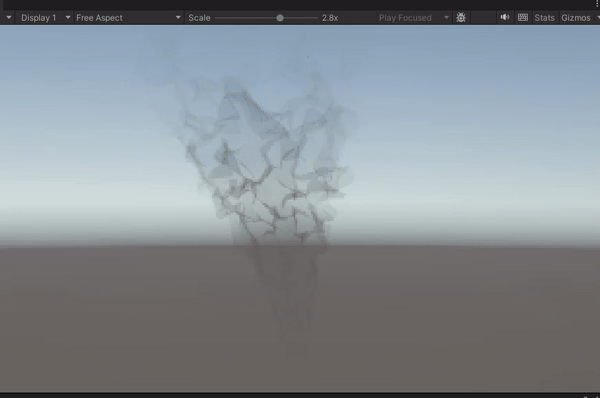

# Lab 07 - Smoke with Unity's Shader Graph
Continue practicing with Unity's shader graph to make
a smoke shader based on [this presentation](https://youtu.be/aYZEmaQUrAo?t=22m11s) by Simon Trumpler.

# Result

# Shader Graph

